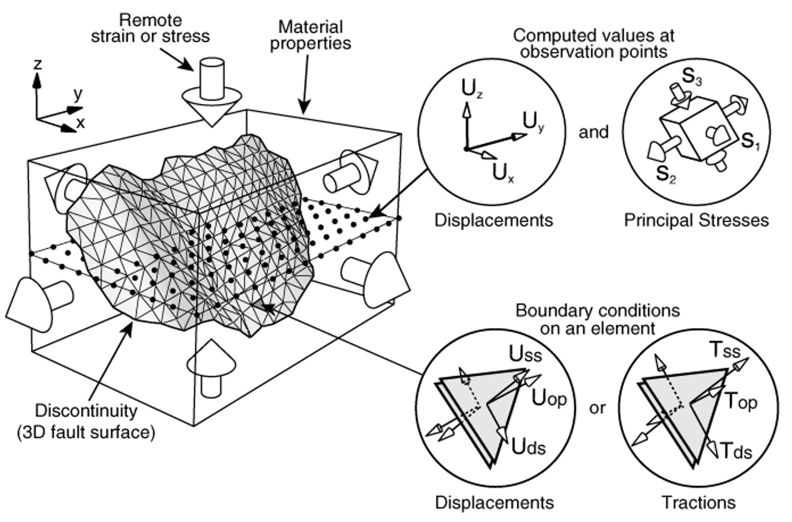
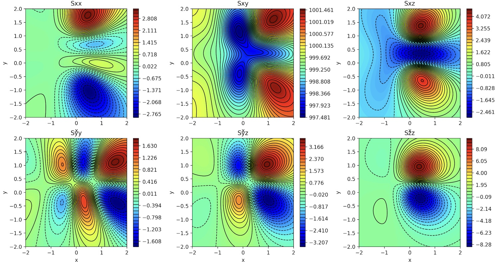

<h1 align="center">Arch&nbsp;×&nbsp;Rosetta</h1>

<p align="center">
  <em>Automatic, multi-language bindings for Arch (private), a 3D BEM code.</em>
</p>

<p align="center">
  <a href="https://github.com/xaliphostes/arch3"></a>
  <a href="https://github.com/xaliphostes/rosetta"></a>

  
  

  
</p>

---

This project points [**Rosetta**](https://github.com/xaliphostes/rosetta) at the [**Arch Library** ](https://github.com/xaliphostes/arch3.git) (successor **Poly3D** and **iBem3D**) and, from a single [`manifest.json`](manifest.json), generates ready-to-build bindings **without touching a line of Arch's source**.

> Arch is a private repos. So this project is provided for information (all the bindings are working of cource).
> 
> __More info about the technology__:
> [Maerten, F., Maerten, L., & Pollard, D. D. (2014). iBem3D, a three-dimensional iterative boundary element method using angular dislocations for modeling geologic structures. Computers and Geosciences, 72, 1-17]((https://www.sciencedirect.com/science/article/abs/pii/S0098300414001496#:~:text=Review-,iBem3D%2C%20a%20three-dimensional%20iterative%20boundary%20element%20method%20using%20angular,dislocations%20for%20modeling%20geologic%20structures))

### Fetch Arch and Rosetta

```sh
cmake -S . -B build && cmake --build build -j
```

### Generate the generator for Arch

```sh
extern/rosetta/bin/rosetta_gen manifest.json gen
cmake -S gen -B gen/build && cmake --build gen/build
```

### Generate the bindings

```sh
./generator bindings
```

### Compile the bindings

#### 1. Compile for Python:
```sh
cmake -S bindings/python -B bindings/python/build && cmake --build bindings/python/build -j
```

#### 2. Compile for nodejs:
```sh
cd bindings/node && npm i && npm run build && cd ../..
```

#### 3. Compile for WebAssembly

First set up a stock [emsdk](https://emscripten.org/docs/getting_started/downloads.html) (no fork needed):
```sh
# One-time emsdk setup
git clone https://github.com/emscripten-core/emsdk.git
cd emsdk && ./emsdk install latest && ./emsdk activate latest
source ./emsdk_env.sh && cd ..
```

Then configure with `emcmake`:
```sh
# Build the wasm bindings (emits arch3.js + arch3.wasm)
emcmake cmake -S bindings/wasm-expanded -B bindings/wasm-expanded/build
cmake --build bindings/wasm-expanded/build -j
```

#### 4. Compile for TypesScript

Nothing to be done. File `d.ts` auto-generated.

### Run the examples

Each backend has a ready-to-run demo at the project root. Build the matching
binding above first, then run from the project root:

#### 1. Python

```sh
python3 example_python.py
```

#### 2. Node (native N-API addon)

```sh
node example_node.js
```

#### 3. WebAssembly with Node

```sh
node example_wasm.js
```
